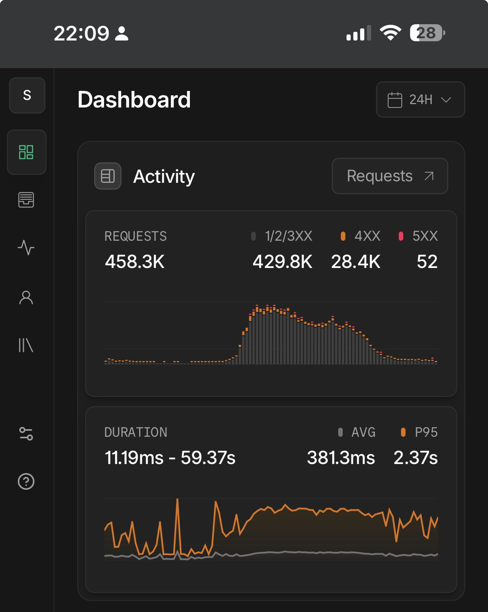

This is a list of links to real **big money-making** projects built with Laravel/PHP.

The goal is to share stories by **real** people, with **real** names, with traffic/revenue numbers if possible.

---

## Table of Contents

- [In-Depth Stories/Articles](#in-depth-storiesarticles) (8 articles)
- [Social Media Posts with Numbers](#social-media-posts-with-numbers) (19 posts)
- [Lists of Projects Built with Laravel/PHP](#lists-of-projects-built-with-laravelphp) (8 lists)
- [Smaller/Hobby Projects Built with Laravel/PHP](#smaller-ish-projects-built-with-laravelphp) (10 stories)

---

## In-Depth Stories/Articles

[Jack Ellis from Fathom Analytics: Does Laravel Scale?](https://usefathom.com/blog/does-laravel-scale)

Awesome long article based on the story of Fathom who run Laravel on infrastructure that can handle over 157 billion requests per month (*data from 2022*). For large projects, Laravel will NOT be the main bottleneck.

---

[Mathias Hansen: How Geocodio keeps 300M addresses up to date](https://www.geocod.io/code-and-coordinates/2025-01-13-how-geocodio-keeps-300M-addresses-up-to-date/)

Their entire platform is built on Laravel and uses Laravel Nova. They also make heavy use of queueing using Laravel Horizon.

---

[Mateus Guimarães: Scaling Laravel to 100M+ jobs and 30,000 requests/sec](https://mateusguimaraes.com/posts/scaling-laravel)

How they scaled to over a hundred million jobs and peaks of 30,000 requests/minute a timespan of only twelve hours, using nothing but Laravel, MySQL and Redis.

---

[Redberry: From 0 to 150K Visitors in 4 Hours: Scaling a Real-Time Engagement Platform](https://laravel.com/blog/from-0-to-150k-visitors-in-4-hours-scaling-a-real-time-engagement-platform)

When 150K users flooded a web platform in just 4 hours, with no ramp-up, no downtime, and real-time interaction required, Redberry made it possible using Laravel Cloud, Filament, PostgreSQL, and Pusher. A story from official Laravel Blog.

---

[Matthew Davis: The Power Behind Mumsnet, the UK’s No. 1 Platform for Parents](https://tighten.com/insights/bol-ep7-matthew-davis-mumsnet/)

Business of Laravel Podcast interview with Matt Stauffer from Tighten, they discuss Mumsnet's full-scale transition to Laravel, unpacking the challenges and victories of their ground-up rewrite.

---

[Galahad Creative: From Zero to 35M: The struggles of scaling Laravel with Octane](https://www.galahadsixteen.com/blog/from-zero-to-35m-the-struggles-of-scaling-laravel-with-octane)

The remarkable success of Laravel Octane in our project can be largely credited to its foundation on Swoole, a high-performance, coroutine-based PHP framework. 

---

[Behind the scenes of Lemon Squeezy with Gilbert Pellegrom](https://www.lemonsqueezy.com/blog/lemonhead-gilbert-pellegrom)

Lemon Squeezy payment provider (*later acquired by Stripe*) was built entirely using Laravel and Vue. PHP gets a lot of hate but the language has come a long way in the last ten years and Laravel really makes it a joy to work with.

---

[Arvid Kahl: One Year of Podscan.fm: Reflecting on Tech & Business Decisions](https://thebootstrappedfounder.com/one-year-of-podscan-reflecting-on-tech-business-decisions/)

A podcast episode where Arvid says that the biggest choice he made at the beginning of Podscan was to build this product with the Laravel framework. As of April 2025, Podscan is somewhere north of five to six terabytes in raw storage.

---

## Social Media Posts with Numbers

[Srinath Reddy on X](https://x.com/srinathdudi/status/1983912143457046822): 

> We are currently doing 30M / month on app built using laravel.

---

[John O'Nolan on X](https://x.com/JohnONolan/status/1983600289396748297):

> Doing ~12M req/mo now on my laravel app on Laravel Cloud - which powers [explore.ghost.org](https://explore.ghost.org) (the public front end is very simple, the back end is much more extensive).

---

[Jake Casto on X](https://x.com/0x15f/status/1728172957619617829):

> Almost 100,000,000 reqs in 24 hours and people say Laravel can't scale

---

[Alam Lam on X](https://x.com/extralam/status/1983915915369705815):

> ~80M req/mo now on laravel app - which powers one of our client project. The public front end by Livewire, app by 
React Native, the backend by Filament. Our server using Azure App Services with Redis and MySQL.

---

[Ben Rüegg on X](https://x.com/bytebln/status/1662500810771648513):

> My 3 VPS (4GB RAM) handling 13,430,000 requests in 6 hours (thats about 37K/minute). Boring Tech FTW: CDN, Load Balancer, PHP-FPM, Redis

---

[Sachin Ganesh on X](https://x.com/_SachinGanesh/status/1985324106959475041):

> One of my site handles ~120M requests/month on a $100 server. Laravel + Octane is 🔥

---

[Al Kafi on LinkedIn](https://www.linkedin.com/posts/al-kafi-sohag_from-breaking-in-regular-usage-to-scaling-activity-7337585766505639936-PM-j/?utm_source=share):

> Our high-performance web application, built with Laravel 12 backend and Blade + Tailwind CSS frontend, handles 109M+ requests monthly.

---

[Lwin Maung on LinkedIn](https://www.linkedin.com/feed/update/urn:li:activity:7391090113990082560?commentUrn=urn%3Ali%3Acomment%3A%28activity%3A7391090113990082560%2C7391107474365284352%29&dashCommentUrn=urn%3Ali%3Afsd_comment%3A%287391107474365284352%2Curn%3Ali%3Aactivity%3A7391090113990082560%29):

> Tiny PHP project ([source on GitHub](https://github.com/lwinmaungmaung/election2020)) but hit 2M/day traffic for Myanmar Election 2020.

---

[Shane on X](https://x.com/digitalshane_/status/1986468002057822293):

> Building [Lucidly.so](https://www.lucidly.so/) with Laravel/React. Hosted on Laravel Cloud and performing wonderfully. Pic is the last 30 days of requests.

---

[Alin Ionut on X](https://x.com/AlinIonutMusat/status/1986545358818677077):

> Here is a day of request for one of my projects. And Nightwatch sample rate is set at 10% for requests, so real numbers are 10x.

---

[Zsoldos Szabolcs on X](https://x.com/SzabiZs/status/1986889000255095202):

> Here is one of our B2B platforms. Migrated all the way fro Laravel 5 to 12.

---

[Jonty Behr on X](https://x.com/jontybehr/status/1811316493906317636):

> We're handling ~230m requests per month (~88 rps) on Laravel across 3 linked sites. Original codebase was written in Laravel 4, but has been upgraded along the way, and now on L11. Monoliths, fully tested, strong typehints.

---

[Dan Brown on Reddit](https://www.reddit.com/r/laravel/comments/1opahh7/comment/nnab371/):

> My Laravel-based open-source project BookStack is used across 7k sites. I'm now receiving a healthy income from just donations, sponsors and support packages!

---

[User External-Working-551 on Reddit](https://www.reddit.com/r/PHP/comments/1opao4g/comment/nnepqw7/?context=1):

> Leroy Merlin Brasil mantains a huge ecommerce made with Laravel, MongoDB and Elasticsearch, with over 15 million users, 2 million products, and $1M/day in sales

---

[Derrick Grigg on X](https://x.com/derrickgrigg/status/1986224210692243781):

> I originally built [PageProofer](https://PageProofer.com) on CodeIgniter and then switched to Laravel way back on version 7. ~53K users, ~$2.5k MMR, ~$300k lifetime revenue, loaded onto ~500k web pages per day.

---

[Octavio Herrera on X](https://x.com/tavioto/status/1986462758661947693):

> [AddressHub](https://address-hub.com/) is built with Laravel and we are processing millions of requests per month.

---

[Sergio on X](https://x.com/planetasergio/status/1986774584968786017):

> [Medicloud.com.ar](https://medicloud.com.ar/) is a highly successful medical platform in Argentina. I am one of the co-founders. And I’m proud to share that the backend and the API are entirely built with PHP and Laravel.

---

[JustSteveKing on X](https://x.com/JustSteveKing/status/1986848203514519930):

> The [Treblle.com](https://treblle.com/) code base was built using PHP and Laravel, and that handles (last I checked) half a billion requests per month.

---

[Jay Patel on X](https://x.com/jaypatel2406/status/1987097228368871847):

> I have built an entire ERP for 3 security companies in Kenya with Laravel / Vue integrated with an Android application. The system effectively caters for management of HRM, CRM and BI for over 5,000 employees. It has been 5 years since the go-live. Good to see happy clients.

---

## Lists of Projects Built with Laravel/PHP

- [Tighten: Built with Laravel: A curated catalog of organizations using Laravel](https://builtwithlaravel.com/)
- [Laravel Daily: 10 Large Open-Source Projects Built with Laravel](https://laraveldaily.com/post/large-laravel-open-source-projects)
- [KrishaWeb: Best Use Cases for Custom Laravel Web Development In 2025](https://www.krishaweb.com/blog/best-laravel-web-development-use-cases-to-explore/)
- [Laravel Daily: 7 Large Open-Source Projects Built with Plain PHP (No Framework)](https://laraveldaily.com/post/8-large-open-source-php-projects-no-framework)
- [BuiltWith: 600k+ Websites using Laravel](https://trends.builtwith.com/websitelist/Laravel)
- [Success Stories: PHP-Powered Projects by Indian Development Firms](https://dev.to/ezeelive/success-stories-php-powered-projects-by-indian-development-firms-1nai)
- [Laradevs: Profitable Businesses Built on Laravel](https://laradevs.com/blog/profitable-businesses-built-on-laravel)

---

## Smaller(-ish) Projects Built with Laravel/PHP

- [Guillaume Souillard: How my project Affilisting made $11K in one month with Gumroad and Laravel](https://www.indiehackers.com/post/how-i-made-11k-in-one-month-with-gumroad-and-laravel-a6906b4b90)
- [Serg Karakhanyan: I made $3,165 in the last 3 days with Larafast.com totaling $4,197 in 20 days](https://www.linkedin.com/posts/karakhanyans_buildinpublic-indiehackers-laravel-activity-7176512167251169281-WFAA/)
- [Same Serg with Another Project: Directify is 1 year old! $50K in revenue and $1.5 MRR. Based on Laravel + Filament Tenancy](https://x.com/karakhanyanS/status/1983422525905482199)
- [Bradley Bernard: I built SplitMyExpenses on nights and weekends with Laravel. I launched v2 in December 2023 and it's now killing it!](https://www.indiehackers.com/post/how-i-found-product-market-fit-the-hard-way-after-a-failed-v1-launch-1e05579903)
- [Edwin Klesman: Building an AI-Empowered SaaS with Laravel: A Founder's Journey to LINQ Me Up](https://www.indiehackers.com/post/building-an-ai-empowered-saas-with-laravel-a-founders-journey-to-linq-me-up-c7d2ac6f8b)
- [Mohammad Emran: Klasio — A modern LMS for creators, educators & online academies — built on Laravel](https://x.com/phpfour/status/1931032903087247701)
- [Ahmad Mas: SaaSykit — a Laravel-based boilerplate with everything you need to build an awesome SaaS](https://x.com/AmasCreates/status/1756329860417351748)
- [Ian Nuttall: I have an SEO SaaS for sale for $30k. It's built in Laravel on the TALL stack.](https://x.com/iannuttall/status/1787844611949416866)
- [Nuno Maduro: Pinkary's running on PHP 8.3, Laravel, Tailwind, Pest, Livewire, Alpine.](https://x.com/enunomaduro/status/1763210145826214248)
- [Freek Van der Herten: Oh Dear 2.0 has been launched - initially built on Laravel Spark, and powering status.laravel.com](https://freek.dev/2343-oh-dear-20-has-been-launched)

---

You know more stories about Laravel/PHP in bigger projects? Contribute a Pull Request or email me povilas@laraveldaily.com